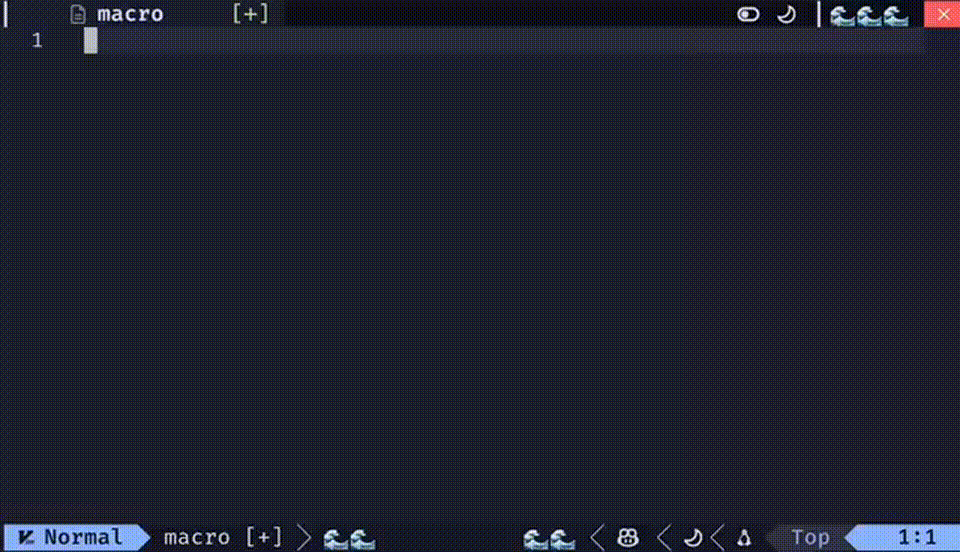

# Macro Notify Plugin for Neovim



**Macro Notify** is a lightweight Neovim plugin that provides notifications for macro recording start and end events. This tool enhances your macro usage experience by offering clear and customizable notifications.

## Features

- **Start/End Notifications**: Displays messages when you start or stop recording a macro.
- **Customizable**: Fully configurable messages and icons.
- **Minimalistic**: Lightweight and optimized for Neovim.

## Installation

Use [lazy.nvim](https://github.com/folke/lazy.nvim) for installation:

```lua
{
  "maarutan/macro-notify.nvim",
  config = function()
    require("macro-notify").setup {
      message_start = "Macro started on register: ",
      message_end = "Macro ended on register: ",
      icon_start = "📼",
      icon_end = "✅",
    }
  end,
}
```

## Default Configuration

The plugin comes with default settings that you can override during setup:

```lua
require("macro-notify").setup {
  message_start = "macro: ",
  message_end = "ended: ",
  icon_start = "🚀",
  icon_end = "💀",
}
```

### Options

- `message_start`: Message displayed when a macro starts (default: "macro: ").
- `message_end`: Message displayed when a macro ends (default: "ended: ").
- `icon_start`: Icon displayed alongside the start notification (default: "🚀").
- `icon_end`: Icon displayed alongside the end notification (default: "💀").

## Usage

1. Start recording a macro by pressing `q` followed by a register (e.g., `qa`).
   - Notification: "🚀 macro: a"
2. Stop recording the macro by pressing `q` again.
   - Notification: "💀 ended: a"

## Requirements

- Neovim 0.7+
- `vim.notify` or a compatible notification plugin

## Contributing

Contributions are welcome! If you find any issues or have ideas for improvements, feel free to open an issue or submit a pull request on the [GitHub repository](https://github.com/maarutan/macro-notify.nvim).

## License

This project is licensed under the MIT License. See the [LICENSE](LICENSE) file for details.

---

Thank you for using **Macro Notify**! Happy macro recording! 🎉
